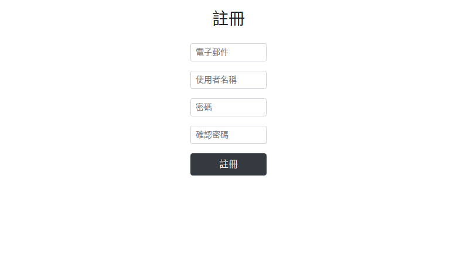
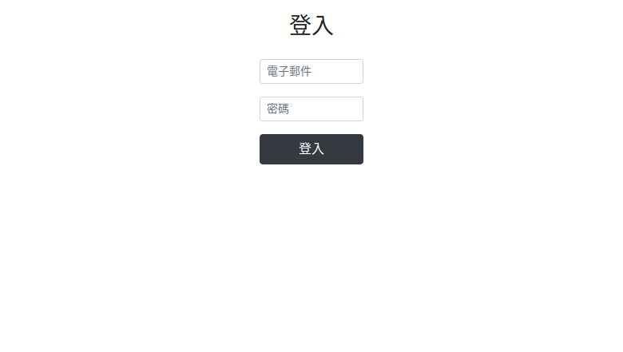

# Devops

讀取測試計畫，運用Selenium測試網站功能，以截圖、生成測試報告，並將所有測驗結果儲存至SQL資料庫。

## 程式碼

```bash=
# 主程式
main.py

# 開啟Csv，生成測試報告
reports.py

# 輸出測試
req.py

# 測試程式
crawler.py

# 資料庫連結
db.py
```

## 結果展示

1. 註冊畫面截圖：<br>
<br>
2. 登入畫面截圖：<br>
<br>
3. 測試報告：<br>
report-2024-12-24-17-32-17.csv